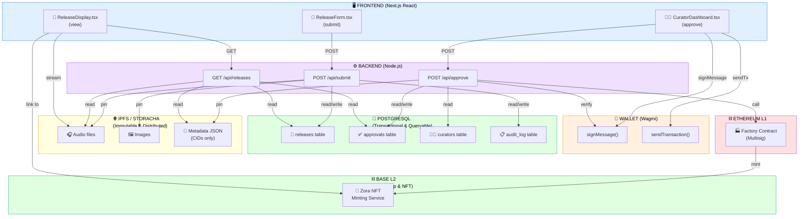

# 🏗️ THREE-LAYER ARCHITECTURE DIAGRAM

Mermaid flowchart visualization of the complete system architecture showing Frontend, Backend, and Infrastructure layers.

---

## Architecture Overview

### 🖥️ FRONTEND (Next.js React)
**Three main components:**
- **ReleaseForm.tsx** - User submits audio files
- **CuratorDashboard.tsx** - Curators review and approve
- **ReleaseDisplay.tsx** - Users view published releases

### ⚙️ BACKEND (Node.js)
**Three main API endpoints:**
- **POST /api/submit** - Handle release submissions
- **POST /api/approve** - Handle curator approvals
- **GET /api/releases** - Query releases

### 👛 WALLET (Wagmi)
**Wallet integration:**
- **signMessage()** - Curator signs approvals
- **sendTransaction()** - Send blockchain transactions

### 💾 POSTGRESQL DATABASE
**Transactional & Queryable Layer:**
- **releases table** - Release submissions & metadata
- **approvals table** - Curator signatures & timestamps
- **curators table** - Curator board members
- **audit_log table** - Compliance records

### 🌐 IPFS / STORACHA
**Immutable & Distributed Layer:**
- **Audio files** - User-submitted MP3s (QmAudio123...)
- **Images** - Cover art & metadata images (QmCover456...)
- **Metadata JSON** - ERC721 metadata (QmMetadata789...)

### ⛓️ ETHEREUM L1
**Governance & Trustless Layer:**
- **Factory Contract** - Orchestrates multisig approvals
- **Multisig** - Safe contract for curator governance

### ⛓️ BASE L2
**Ownership & NFT Layer:**
- **Zora NFT Minting Service** - Creates NFTs for releases
- **Ownership** - Users own NFTs in their wallets

---

## Data Flow Summary

1. **User Submits** → Frontend form → Backend `/api/submit`
2. **Temporary Storage** → Database (releases table) + temp file storage
3. **Curator Reviews** → Dashboard queries Database for pending releases
4. **Curator Signs** → Wallet signs approval message
5. **Approval Recorded** → Backend stores in approvals table
6. **Threshold Check** → If 3/3 signatures, trigger async job
7. **IPFS Publishing** → Pin audio, cover art, and metadata to IPFS
8. **Blockchain Minting** → Factory contract calls Zora on Base L2
9. **NFT Created** → Ownership recorded on blockchain
10. **User Views** → Frontend queries Database + IPFS + Blockchain

---

## Layer Characteristics

| Layer | Technology | Characteristics | Purpose |
|-------|-----------|-----------------|---------|
| **Database** | PostgreSQL | Transactional, Queryable | State management & audit trail |
| **Content** | IPFS/Storacha | Immutable, Distributed | Permanent content storage |
| **Governance** | Ethereum L1 | Trustless, Multisig | Curation authority |
| **Ownership** | Base L2 (Zora) | NFT, Cost-efficient | User ownership & trading |

