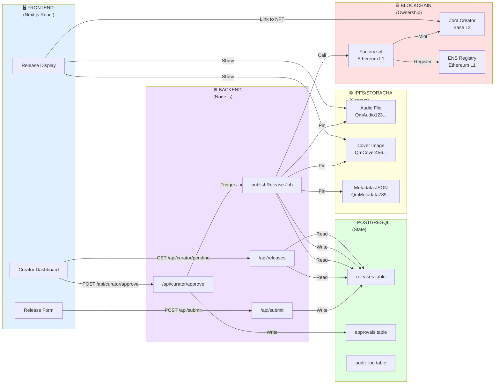
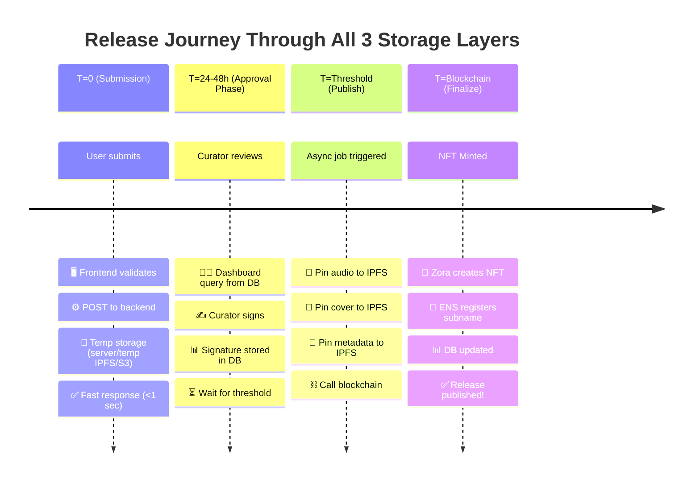

# 📊 CATALOGUE ARCHITECTURE FLOWCHART (Mermaid)

## Complete Release Flow: Submission to Published

```mermaid
flowchart TD
    Start([👤 User Submits Release]) --> FrontendValidate["🔍 Frontend Validates<br/>- Format<br/>- Size &lt; 10MB<br/>- MIME type"]
    
    FrontendValidate --> APISubmit["📤 POST /api/submit<br/>(HTTPS to backend)"]
    
    APISubmit --> BackendValidate["✅ Backend Validates<br/>- Schema<br/>- File type<br/>- Size<br/>- MIME type"]
    
    BackendValidate --> ExtractMetadata["📝 Extract from MP3<br/>- Duration<br/>- Cover art<br/>- ID3 tags"]
    
    ExtractMetadata --> TempStore["💾 Store TEMPORARILY<br/>- Option 1: Server disk<br/>- Option 2: Temp IPFS<br/>- Option 3: S3 bucket"]
    
    TempStore --> DBWrite1["📊 INSERT INTO releases<br/>- id: PDA-001<br/>- status: pending<br/>- temp_file_path<br/>- media_ipfs_hash: NULL<br/>- cover_image_hash: NULL"]
    
    DBWrite1 --> Response1["✅ Response to Frontend<br/>{<br/>  id: PDA-001,<br/>  status: pending<br/>}"]
    
    Response1 --> UserMsg1["✨ User sees:<br/>Submitted!<br/>Waiting for curation..."]
    
    UserMsg1 --> Wait["⏳ 24-48 hours<br/>Curator reviews"]
    
    Wait --> CuratorDash["👨‍⚖️ Curator Dashboard<br/>- Query pending releases<br/>- Show PDA-001"]
    
    CuratorDash --> CuratorReview["🔎 Curator Reviews<br/>- Audio quality<br/>- Metadata accuracy<br/>- Artist legitimacy"]
    
    CuratorReview --> CuratorSign["✍️ Curator Signs<br/>solidityPackedKeccak256<br/>['RELEASE_APPROVAL', 'PDA-001']<br/>↓<br/>Wallet signs: 0x9876543..."]
    
    CuratorSign --> APICurator["📤 POST /api/curator/approve<br/>- releaseId<br/>- curatorAddress<br/>- signature"]
    
    APICurator --> VerifySig["✔️ Backend Verifies<br/>- Signature valid?<br/>- Curator in Safe?"]
    
    VerifySig --> StoreApproval["📊 INSERT INTO approvals<br/>- release_id: PDA-001<br/>- signer: 0xCurator1<br/>- signature: 0x9876543...<br/>- signed_at: NOW"]
    
    StoreApproval --> CheckThreshold{"Threshold Met?<br/>Count >= 3"}
    
    CheckThreshold -->|No| ResponsePartial["✅ Response<br/>1/3 approvals ⏳"]
    ResponsePartial --> Curator2["👨‍⚖️ Curator 2 Signs<br/>(same process)"]
    Curator2 --> CheckThreshold
    
    CheckThreshold -->|Still No| ResponsePartial2["✅ Response<br/>2/3 approvals ⏳"]
    ResponsePartial2 --> Curator3["👨‍⚖️ Curator 3 Signs<br/>(same process)"]
    Curator3 --> CheckThreshold
    
    CheckThreshold -->|Yes| ThresholdMet["🎉 THRESHOLD MET!<br/>3/3 approvals ✅"]
    
    ThresholdMet --> QueueJob["⏰ Queue Async Job<br/>publishRelease(PDA-001)"]
    
    QueueJob --> JobStart["🚀 ASYNC JOB START"]
    
    JobStart --> LoadRelease["📂 Load Release<br/>- Get temp_file_path<br/>- Get metadata"]
    
    LoadRelease --> PinAudio["📌 Pin Audio to Storacha<br/>await pinToIPFS(audioFile)<br/>↓<br/>QmAudio123..."]
    
    PinAudio --> PinCover["📌 Pin Cover to Storacha<br/>await pinToIPFS(coverImage)<br/>↓<br/>QmCover456..."]
    
    PinCover --> CreateMetadata["📋 Create Metadata JSON<br/>{<br/>  name: User's Song,<br/>  image: ipfs://QmCover456...,<br/>  animation_url: ipfs://QmAudio123...,<br/>  properties: { ... }<br/>}"]
    
    CreateMetadata --> PinMetadata["📌 Pin Metadata to Storacha<br/>await pinToIPFS(metadataJSON)<br/>↓<br/>QmMetadata789..."]
    
    PinMetadata --> CleanupTemp["🗑️ Clean Up Temp File<br/>fs.unlinkSync(tempPath)"]
    
    CleanupTemp --> BlockchainCall["⛓️ Call Factory Contract<br/>factory.publishRelease(<br/>  releaseId: PDA-001,<br/>  metadataURI: QmMetadata789...,<br/>  contributor: 0xUser123<br/>)"]
    
    BlockchainCall --> ZoraMint["🎨 Zora Mints NFT (Base L2)<br/>- Owner: 0xUser123<br/>- Metadata: ipfs://QmMetadata789...<br/>- tokenId: 1"]
    
    ZoraMint --> ENSRegister["📛 Register ENS Subname<br/>- Name: pda-001.palaupalau.eth<br/>- Resolver: PublicResolver<br/>- Text record: zoraNFT<br/>- Value: base:0xZora/1"]
    
    ENSRegister --> DBUpdateFinal["📊 UPDATE releases SET<br/>- status: published<br/>- tokenId: 1<br/>- zoraNFT: base:0xZora/1<br/>- metadataURI: QmMetadata789...<br/>- ensSubname: pda-001.palaupalau.eth"]
    
    DBUpdateFinal --> JobComplete["✅ JOB COMPLETE"]
    
    JobComplete --> UserQuery["🔍 User Queries<br/>GET /api/releases/PDA-001"]
    
    UserQuery --> UserResponse["📊 Backend Returns<br/>{<br/>  id: PDA-001,<br/>  status: published,<br/>  mediaIPFSHash: QmAudio123...,<br/>  metadataURI: QmMetadata789...,<br/>  zoraNFT: base:0xZora/1,<br/>  tokenId: 1,<br/>  ensSubname: pda-001.palaupalau.eth<br/>}"]
    
    UserResponse --> FrontendDisplay["🎵 Frontend Displays<br/>- Title & Description<br/>- Audio Player<br/>- View on OpenSea<br/>- View on ENS"]
    
    FrontendDisplay --> WalletCheck["👛 User Checks Wallet<br/>(Base L2)"]
    
    WalletCheck --> NFTOwned["✅ NFT Owned<br/>- Contract: 0xZora<br/>- TokenID: 1<br/>- Owner: 0xUser123"]
    
    NFTOwned --> Complete([🎉 COMPLETE<br/>Release Published!])
    
    style Start fill:#90EE90
    style Complete fill:#90EE90
    style ThresholdMet fill:#FFD700
    style JobStart fill:#FFD700
    style TempStore fill:#87CEEB
    style PinAudio fill:#87CEEB
    style PinCover fill:#87CEEB
    style PinMetadata fill:#87CEEB
    style BlockchainCall fill:#DDA0DD
    style ZoraMint fill:#DDA0DD
    style ENSRegister fill:#DDA0DD
    style NFTOwned fill:#90EE90
```

---

## Architecture Layers

---

## Timeline: 3-Layer Storage

---

## Key Points

### Submission Phase (Fast & Free)
- ✅ No IPFS delays (<1 second response)
- ✅ No IPFS costs (temp storage only)
- ✅ Temporary file stored locally
- ⏳ Waiting for curator approval

### Approval Phase (Database Only)
- ✅ Database queries for pending releases
- ✅ Signatures stored for audit trail
- ✅ Threshold checking with transactions
- ⏳ Waiting for curator #3 signature

### Publishing Phase (Async Job)
- ✅ Triggered when threshold met
- ✅ Files pinned to IPFS (permanent)
- ✅ Metadata created with all approvals
- ✅ Blockchain publishes NFT

### Final State (Permanent)
- ✅ Database has complete record
- ✅ IPFS has permanent content (12+ months)
- ✅ Blockchain has ownership proof
- ✅ User owns NFT on Base L2

