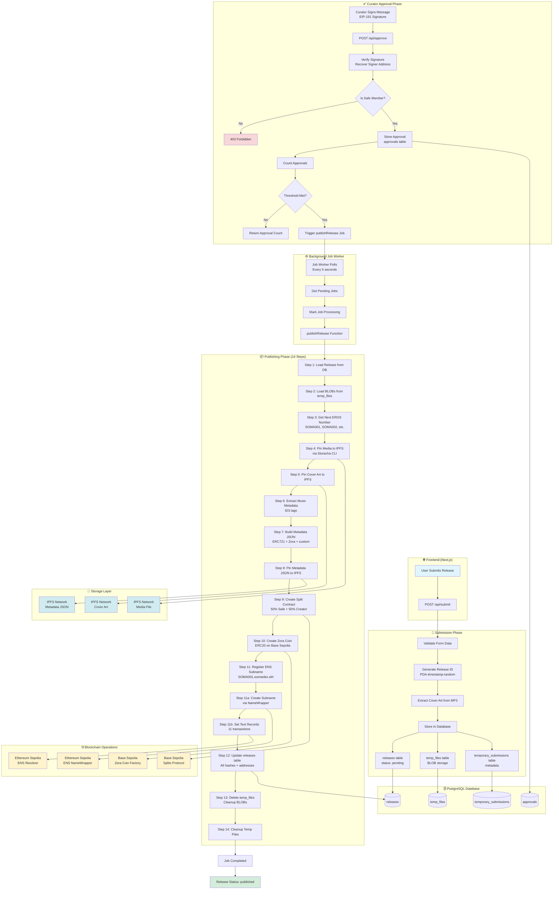

# Catalogue Technical Architecture

## Overview

Catalogue is a decentralized music catalog platform that enables artists to submit releases for curator approval, which are then published to IPFS, minted as Zora coins on Base, and registered on ENS. The system uses a Safe multisig for curator governance and implements a complete end-to-end workflow from submission to on-chain publication.

## System Architecture

### Technology Stack

- **Frontend**: Next.js 14+ (App Router), React, TypeScript
- **Backend**: Next.js API Routes, Node.js
- **Database**: PostgreSQL (with connection pooling)
- **Blockchain**: 
  - Ethereum Sepolia (L1) - ENS registration
  - Base Sepolia (L2) - Zora coins, Splits contracts
- **Storage**: IPFS via Storacha CLI
- **Wallet Integration**: Wagmi, RainbowKit
- **Multisig**: Safe Protocol (Gnosis Safe)

### Core Services

1. **IPFS Service** (`lib/services/ipfs.ts`) - Handles file pinning via Storacha CLI
2. **ENS Service** (`lib/services/ens.ts`) - Manages ENS subname registration and text records
3. **Zora Service** (`lib/services/zora.ts`) - Creates ERC20 creator coins on Base
4. **Splits Service** (`lib/services/splits.ts`) - Deploys revenue distribution contracts
5. **Safe Service** (`lib/services/safe.ts`) - Verifies curator signatures and Safe membership
6. **Jobs Service** (`lib/services/jobs.ts`) - Background job processing for release publication
7. **Music Metadata Service** (`lib/services/musicMetadata.ts`) - Extracts ID3 tags from audio files

## End-to-End Flow

> **Visual Diagram**: See [`architecture-flow.svg`](./architecture-flow.svg) or [`architecture-flow.png`](./architecture-flow.png) for the rendered flowchart.

## Component Details

### 1. Frontend Components

#### Submission Flow
- **`app/page.tsx`** - Main submission form
- **`app/submit/page.tsx`** - Submission page with form validation
- **`app/components/release-card.tsx`** - Display release cards
- **`app/components/status-badge.tsx`** - Status indicators (pending/approved/published)

#### Curator Dashboard
- **`app/curator/dashboard/page.tsx`** - Curator approval interface
- Displays pending releases
- Allows curators to sign approval messages

#### Release Discovery
- **`app/index/page.tsx`** - Homepage listing published releases
- **`app/index/[ensName]/page.tsx`** - Individual release page by ENS name

### 2. API Routes

#### `/api/submit` (POST)
- Accepts FormData with title, description, artists, mediaFile
- Validates input against schema
- Generates unique release ID (PDA-timestamp-random)
- Extracts cover art from MP3
- Stores metadata in `releases`, `temporary_submissions`, and `temp_files` tables
- Returns release object with `status: 'pending'`

#### `/api/approve` (POST)
- Accepts `releaseId` and `signature` (EIP-191)
- Verifies signature and recovers curator address
- Checks if curator is Safe member via `getOwners()`
- Stores approval in `approvals` table
- Counts approvals and checks threshold via `getThreshold()`
- If threshold met, directly calls `publishRelease()` (no job queue for immediate execution)

#### `/api/releases` (GET)
- Discovers published releases by querying ENS
- Starts from SOMA011 and increments until no more found
- Uses ENS as source of truth (no database dependency)
- Returns array of release metadata

#### `/api/releases/[id]` (GET)
- Fetches release by database ID
- Returns full release object with approvals

#### `/api/releases/single` (GET)
- Queries ENS by subname (e.g., `soma012.scenedex.eth`)
- Returns release metadata from ENS text records

#### `/api/init` (POST/GET)
- Initializes background job worker
- Starts polling loop (every 5 seconds)

### 3. Database Schema

#### Core Tables

**`releases`**
- Primary release data
- Status: `pending`, `approved`, `published`
- Stores IPFS hashes, ENS subname, Zora coin address, split address
- Foreign key relationships to approvals

**`temp_files`**
- Temporary BLOB storage (BYTEA)
- Stores MP3 file data and cover art before IPFS pinning
- Auto-expires after 7 days
- Deleted after successful publication

**`temporary_submissions`**
- Pre-approval metadata staging
- Deleted after approval/rejection

**`approvals`**
- Curator approval signatures
- Links to `releases` via `releaseId`
- Stores signer address, signature, timestamp

**`curator_settings`**
- Platform-wide settings
- Stores Safe multisig address
- Stores approval threshold

**`jobs`** (implicit, referenced in code)
- Background job queue
- Fields: `id`, `release_id`, `job_type`, `status`, `data`, `created_at`, `started_at`, `completed_at`, `attempts`, `max_attempts`, `error_message`

### 4. Service Layer

#### IPFS Service (`lib/services/ipfs.ts`)
- **`pinToIPFS(filePath)`** - Pins file via Storacha CLI with retry logic
- **`pinBufferToIPFS(buffer, filename, releaseId)`** - Pins Buffer to IPFS
- **`extractAndPinCoverArt(mp3FilePath)`** - Extracts and pins cover art
- Features: Exponential backoff, transient error detection, sequential uploads

#### ENS Service (`lib/services/ens.ts`)
- **`getNextEROSNumber()`** - Finds next available SOMA/EROS number by checking ENS resolver
- **`formatEROSNumber(number)`** - Formats number as SOMA001, SOMA002, etc.
- **`registerEROSRelease()`** - Prepares ENS registration with text records
- **`createENSSubname()`** - Creates subname via NameWrapper on Sepolia L1
- **`executeENSRecords()`** - Executes setText transactions (11 records)
- Uses ENSIP-15 normalization for all names

#### Zora Service (`lib/services/zora.ts`)
- **`createCoinForRelease()`** - Deploys ERC20 coin on Base Sepolia
- Uses direct factory contract call (bypasses broken SDK API)
- Factory: `0x777777751622c0d3258f214F9DF38E35BF45baF3`
- Flow: `simulateContract()` → `writeContract()` → `waitForTransactionReceipt()` → extract coin address from logs
- Coin symbol: `PDA{number}` (e.g., `PDA001`)

#### Splits Service (`lib/services/splits.ts`)
- **`createSplitForRelease()`** - Deploys SplitV2 contract on Base Sepolia
- 50% Safe (curator), 50% Submitter (creator)
- 1% distributor fee
- Push type (automatic distribution)
- Safe is owner (can pause if needed)

#### Safe Service (`lib/services/safe.ts`)
- **`verifyCuratorSignature()`** - EIP-191 signature verification
- **`isSafeMember()`** - Checks if address is Safe owner via `getOwners()`
- **`getApprovalThreshold()`** - Gets required approvals via `getThreshold()`
- **`getSafeAddress()`** - Loads Safe address from database

#### Jobs Service (`lib/services/jobs.ts`)
- **`enqueuePublishJob()`** - Adds job to queue
- **`getPendingJobs()`** - Fetches pending jobs
- **`publishRelease()`** - Main publishing function (14 steps)
- **`startJobWorker()`** - Background polling worker (5 second interval)

### 5. Data Flow Details

#### Submission → Approval
1. User submits form with MP3 file
2. Server extracts cover art, stores BLOBs in `temp_files`
3. Release created with `status: 'pending'`
4. Curators review and sign approval messages
5. Each approval stored in `approvals` table
6. When threshold met, `publishRelease()` is called

#### Publishing → On-Chain
1. Load release and BLOBs from database
2. Get next EROS number (SOMA001, SOMA002, etc.)
3. Pin media, cover, and metadata to IPFS
4. Create split contract (50/50 revenue)
5. Create Zora coin (uses split as payout recipient)
6. Register ENS subname (SOMA001.scenedex.eth)
7. Set 11 text records on ENS resolver
8. Update database with all addresses and hashes
9. Delete temp files (cleanup)

#### ENS Text Records
Each release stores:
- `avatar` - Cover art IPFS URI
- `description` - Release description
- `address` - Creator wallet address
- `eth.scenedex.releaseId` - EROS number (SOMA001)
- `eth.scenedex.artists` - Artist names
- `eth.scenedex.mediaIPFS` - Media IPFS hash
- `eth.scenedex.metadataURI` - Metadata JSON IPFS URI
- `eth.scenedex.zoraCoinAddress` - Zora coin contract
- `eth.scenedex.zoraCoinSymbol` - Coin symbol
- `eth.scenedex.splitAddress` - Split contract address

### 6. Security & Validation

#### Signature Verification
- EIP-191 standard message signing
- Message: Release ID (plain string)
- Recovery: `ethers.verifyMessage()`
- Prevents replay attacks (each release ID is unique)

#### Safe Membership
- On-chain verification via `getOwners()`
- No database trust required
- Curator must be in Safe owner list

#### Input Validation
- Zod schemas for all inputs
- File type validation (audio only)
- File size limits (50MB max)
- Wallet address format validation

### 7. Error Handling

#### Retry Logic
- IPFS uploads: 3 attempts with exponential backoff
- Transient error detection (timeouts, connection resets)
- Job queue: Max attempts with error logging

#### Graceful Degradation
- Cover art extraction failures are non-fatal
- Split creation failures don't block publishing
- ENS registration failures are logged but don't crash

### 8. Environment Variables

Required environment variables:
- `DATABASE_URL` - PostgreSQL connection string
- `SEPOLIA_RPC_URL` - Ethereum Sepolia RPC endpoint
- `BASE_RPC_URL` - Base Sepolia RPC endpoint
- `CURATOR_PRIVATE_KEY` - Private key for coordinator transactions
- `ENS_DOMAIN` - Parent ENS domain (scenedex.eth)
- `ENS_RESOLVER_SEPOLIA` - ENS resolver contract address
- `ENS_NAMEWRAPPER_SEPOLIA` - NameWrapper contract address
- `ENS_SUBNAME_PREFIX` - Prefix for subnames (SOMA, EROS)
- `ZORA_COIN_FACTORY_ADDRESS` - Zora coin factory contract
- `NEXT_PUBLIC_WALLETCONNECT_PROJECT_ID` - WalletConnect project ID

## Deployment Architecture

### Production Considerations

1. **Job Worker**: Should run as separate process or use Vercel Cron/Background Functions
2. **Database**: PostgreSQL with connection pooling (max 20 connections)
3. **IPFS**: Storacha CLI must be installed on server
4. **Blockchain**: Separate RPC endpoints for L1 (Sepolia) and L2 (Base Sepolia)
5. **Private Keys**: Store securely (Vercel Environment Variables, AWS Secrets Manager)

### Scaling Considerations

- Job queue can be moved to external service (BullMQ, AWS SQS)
- IPFS pinning can be parallelized for multiple releases
- ENS text record setting can be batched (currently sequential)
- Database indexes on `status`, `createdBy`, `createdAt` for fast queries

## Testing

- Unit tests: `npm run test`
- Validation tests: `npm run test:validation`
- Safe tests: `npm run test:safe`
- Jobs tests: `npm run test:jobs`
- E2E approval tests: `npm run test:approve-e2e`

## Future Enhancements

1. **NFT Minting**: Currently creates Zora coins, could add NFT minting
2. **Indexing**: The Graph subgraph for event indexing
3. **Caching**: Redis for ENS query caching
4. **Monitoring**: Sentry for error tracking, DataDog for metrics
5. **Batch Operations**: Batch ENS setText calls in single transaction

