# 📐 STORAGE ARCHITECTURE - VISUAL GUIDE
## Understanding the Complete Picture

---

## 🎬 THE COMPLETE JOURNEY: One Release From Start to Finish

```mermaid
flowchart TD
    Start([👤 User Submits Audio File]) --> FrontendValidate["🔍 Frontend Validates<br/>- Format, Size, MIME"]
    FrontendValidate --> APISubmit["📤 POST /api/submit"]
    
    APISubmit --> BackendValidate["✅ Backend Validates<br/>- Schema, File type, Size"]
    BackendValidate --> ExtractMeta["📝 Extract MP3 Metadata<br/>- Duration, Cover art, ID3 tags"]
    ExtractMeta --> TempStore["💾 Store TEMP (NO IPFS!)<br/>- Server disk OR<br/>- Temp IPFS OR<br/>- S3 bucket"]
    
    TempStore --> DBWrite1["📊 INSERT INTO releases<br/>- temp_file_path: /tmp/...<br/>- media_ipfs_hash: NULL<br/>- status: pending"]
    DBWrite1 --> Response1["✅ Response to Frontend<br/>⚡ FAST: &lt;1 sec"]
    Response1 --> UserMsg1["📱 User sees:<br/>Submitted! Waiting..."]
    
    UserMsg1 --> Wait["⏳ 24-48 hours"]
    Wait --> CuratorDash["👨‍⚖️ Curator Dashboard<br/>Query pending releases"]
    
    CuratorDash --> CuratorReview["🔎 Curator Reviews<br/>Quality + Legitimacy"]
    CuratorReview --> CuratorSign["✍️ Curator Signs<br/>with Wallet"]
    
    CuratorSign --> APICurator["📤 POST /api/curator/approve"]
    APICurator --> VerifySig["✔️ Verify Signature<br/>Recover address + Check Safe"]
    
    VerifySig --> StoreApproval["📊 INSERT INTO approvals"]
    StoreApproval --> CheckThreshold{{"Threshold Met?<br/>1/3 → 2/3 → 3/3"}}
    
    CheckThreshold -->|No| ResponsePartial["⏳ 1/3 or 2/3 approvals"]
    ResponsePartial --> Curator2["👨‍⚖️ Curator 2 Signs"]
    Curator2 --> CheckThreshold
    
    CheckThreshold -->|Yes| ThresholdMet["🎉 THRESHOLD MET!<br/>3/3 approvals ✅"]
    ThresholdMet --> QueueJob["⏰ Queue Async Job:<br/>publishRelease"]
    
    QueueJob --> JobStart["🚀 ASYNC JOB START<br/>⭐ NOW IPFS PINNING HAPPENS"]
    
    JobStart --> PinAudio["📌 STEP 1: Pin Audio to Storacha<br/>Result: QmAudio123..."]
    PinAudio --> PinCover["📌 STEP 2: Pin Cover to Storacha<br/>Result: QmCover456..."]
    PinCover --> CreateMeta["📌 STEP 3: Create & Pin Metadata JSON<br/>Result: QmMetadata789..."]
    
    CreateMeta --> UpdateDB["📊 STEP 4: Update DB with permanent CIDs<br/>Clean up temp file"]
    UpdateDB --> BlockchainCall["⛓️ STEP 5: Call Factory.publishRelease<br/>Ethereum L1"]
    
    BlockchainCall --> ZoraMint["🎨 STEP 6: Zora Mints NFT on Base L2<br/>Owner: 0xUser123, TokenID: 1"]
    ZoraMint --> ENSRegister["📛 STEP 7: Register ENS Subname<br/>pda-001.palaupalau.eth"]
    
    ENSRegister --> DBFinal["📊 Update releases status=published"]
    DBFinal --> JobComplete["✅ JOB COMPLETE"]
    
    JobComplete --> UserQuery["🔍 User Queries /api/releases/PDA-001"]
    UserQuery --> UserDisplay["🎵 Frontend Displays Release<br/>Audio player + NFT links"]
    UserDisplay --> WalletCheck["👛 User checks Base L2 wallet"]
    WalletCheck --> Complete(["✅ COMPLETE! NFT Owned"])
    
    style Start fill:#90EE90
    style Complete fill:#90EE90
    style ThresholdMet fill:#FFD700
    style JobStart fill:#FFD700
    style TempStore fill:#87CEEB
    style PinAudio fill:#87CEEB
    style PinCover fill:#87CEEB
    style CreateMeta fill:#87CEEB
    style BlockchainCall fill:#DDA0DD
    style ZoraMint fill:#DDA0DD
    style ENSRegister fill:#DDA0DD
    style JobComplete fill:#90EE90
```



---

## 🔄 THE THREE LAYERS IN ACTION

### Layer 1: PostgreSQL (State)
```
Timeline of what happened:

t=0:00   Release submitted (pending)
t=0:05   Curator 1 signed (1/3)
t=0:10   Curator 2 signed (2/3)
t=0:15   Curator 3 signed (3/3) ← Threshold met!
t=0:20   Async job: publish to IPFS + blockchain
t=0:25   Status changed to 'published'

All timestamps + approvals stored in PostgreSQL
  ↑
  User/curator can query: "When was this approved?"
  Auditor can verify: "All 3 curators signed?"
  System can log: "How long did approval take?"
```

### Layer 2: IPFS (Content)
```
Addresses (CIDs):

QmAudio123...    ← Audio file (10MB)
  ↓ Available forever
  Served by: multiple IPFS nodes
  Pinned by: Storacha (12 months minimum)
  Accessed via: gateway.pinata.cloud or any IPFS gateway

QmCover456...    ← Cover image (500KB)
  ↓ Available forever
  Served by: multiple IPFS nodes
  Referenced by: metadata JSON

QmMetadata789... ← Metadata JSON (5KB)
  {
    name: "User's Song",
    image: "ipfs://QmCover456...",
    animation_url: "ipfs://QmAudio123...",
    ...
  }
  ↓ Available forever
  Referenced by: NFT on blockchain
```

### Layer 3: Blockchain (Truth)
```
Ethereum L1 + Base L2:

Factory.sol (L1)
  ↓ Event log
  ReleaseAdded(
    releaseId: "PDA-001",
    contributor: "0xUser123",
    metadataURI: "QmMetadata789...",
    tokenId: 1
  )

Zora NFT (Base L2)
  Owner: 0xUser123
  Token: tokenId 1
  Metadata: ipfs://QmMetadata789...
  ↓ Immutable ownership record

ENS (L1)
  pda-001.palaupalau.eth
  → address: 0xUser123
  → text["zoraNFT"]: "base:0xZora/1"
  ↓ Immutable name record
```

---

## 💰 COST BREAKDOWN: One Release Through Complete Flow

```
USER'S COST (borne by Catalogue):
  Database storage:   $0.001 per release (fraction of $25/month)
  IPFS pinning:       $0.00 to $0.10 per release (Storacha)
  Ethereum gas:       $25-100 per release (depending on network congestion)
  Base L2 gas:        $1-5 per release (NFT mint)
  ENS registration:   $5 per year (1-4 releases yearly)
  ─────────────────────────────────────
  Total:              ~$30-110 per release

SCALE (1000 releases/month):
  Fixed costs:        $100/month (database, indexing)
  Variable costs:     $30,000-110,000 (gas for blockchain)
  Total:              ~$30-110k/month

COST EFFICIENCY:
  This is why 3-layer architecture matters
  ❌ If all on-chain: $500-5,000 per release = $500k-5M/month
  ✅ Our approach:   $30-110 per release = $30k-110k/month
  💰 Savings:        90% reduction in costs
```

---

## 🛡️ FAULT TOLERANCE: What If X Fails?

```
If DATABASE fails (PostgreSQL):
  ❌ Can't query pending releases
  ✅ Content safe on IPFS forever
  ✅ NFTs safe on blockchain forever
  → Restore from backup (1-4 hours)

If IPFS fails (Storacha down):
  ❌ Audio can't be streamed temporarily
  ✅ Database still has metadata (title, description, etc.)
  ✅ NFT still exists on blockchain
  → Wait for Storacha recovery or use backup IPFS node

If BLOCKCHAIN fails (Ethereum/Base congestion):
  ❌ Can't mint new NFTs temporarily
  ✅ Existing data safe in database
  ✅ Content safe on IPFS
  → Queue publishing job, retry when network recovers

If EVERYTHING fails:
  ❌ Catalogue platform goes down
  ✅ Users can still access content via direct IPFS CIDs
  ✅ NFTs transferable on other marketplaces (OpenSea, etc.)
  ✅ ENS names still resolve to IPFS
  → Catalogue could be rebuilt, content persists
```

---

## 📊 QUERY PERFORMANCE: Why Each Layer?

```
Query: "Show me all releases I created"

Database approach (FAST): ✅
  SELECT * FROM releases 
  WHERE created_by = '0xUser123' 
  LIMIT 10
  ↓ Result: 50ms

Blockchain approach (SLOW): ❌
  1. Connect to Ethereum RPC
  2. Call Factory contract (or indexer)
  3. Iterate through all events
  4. Filter by contributor
  5. Parse each event
  ↓ Result: 5-30 seconds

IPFS approach (IMPOSSIBLE): ❌
  IPFS has no SQL
  Can't query across thousands of files
  Would need to download entire IPFS dataset locally


Query: "Stream the audio file for PDA-001"

Database approach (INEFFICIENT): ❌
  Store 10MB MP3 in PostgreSQL
  Every query downloads entire file
  Expensive bandwidth, slow retrieval

Blockchain approach (IMPOSSIBLE): ❌
  Max contract storage: few hundred MB total
  Gas cost for 10MB: $50,000+
  No way to stream

IPFS approach (PERFECT): ✅
  Audio hash: QmAudio123...
  URL: https://gateway.pinata.cloud/ipfs/QmAudio123...
  ↓ Stream from any IPFS gateway
  Result: <1 second first byte


Query: "Prove this release is real and was curated by 3 people"

Database approach (CENTRALIZED): ⚠️
  Returns database records
  But what if Catalogue lies or deletes data?
  No way to verify outside platform

Blockchain approach (TRUSTLESS): ✅
  Call: zora.ownerOf(1) → 0xUser123
  Call: factory.getReleaseAdded(1) → event log
  Verify signatures: 0xCurator1, 0xCurator2, 0xCurator3
  ↓ Anyone can verify without trusting Catalogue
```

---

## 🎯 MENTAL MODEL: Remember This

```
Think of it like a book in a library:

DATABASE (PostgreSQL):
  = Library card catalog
  Lets you query: "Show me all books by Author X"
  Lets you query: "Show me all books approved on Jan 5"
  Fast queries, complex filters

IPFS:
  = The actual book pages
  Immutable (can't change content)
  Distributed (at multiple libraries)
  Anyone can read (decentralized)

BLOCKCHAIN:
  = The legal registry
  "This book belongs to Person 0xUser123"
  "These 3 librarians verified it" (multisig)
  Permanent, trustless proof

TOGETHER:
  User searches catalog (DB) → finds book
  Reads the book (IPFS) → gets content
  Checks registry (Blockchain) → verifies ownership
  ✅ Complete transparency without vendor lock-in
```

---

## ✨ THAT'S THE COMPLETE PICTURE!

You now understand:
- ✅ Why PostgreSQL for state
- ✅ Why IPFS for content
- ✅ Why blockchain for ownership
- ✅ Why NOT just one layer
- ✅ How they work together
- ✅ Cost implications
- ✅ Fault tolerance
- ✅ Query performance

Ready to start Day 1 setup? → Go to `DAY1-KICKOFF-CHECKLIST.md`


