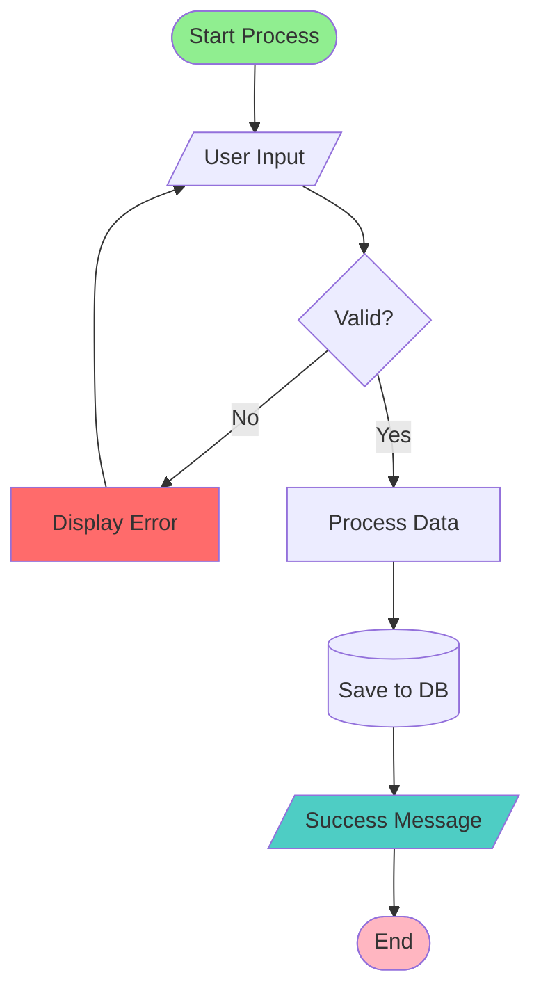
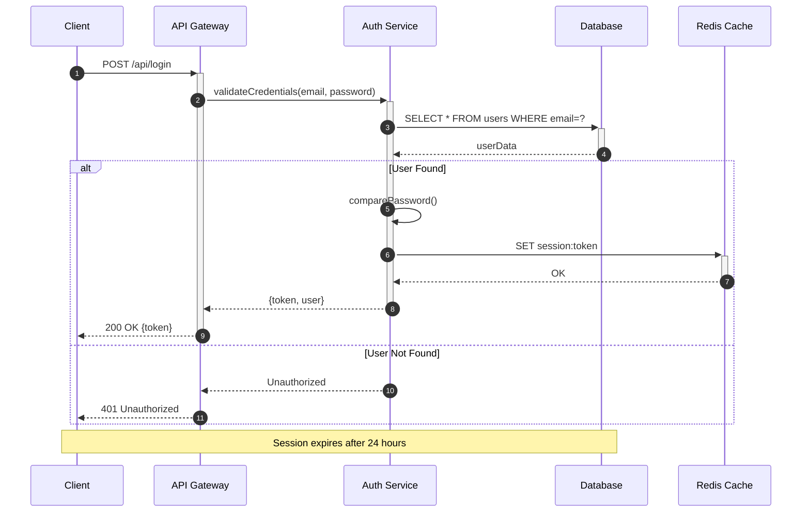
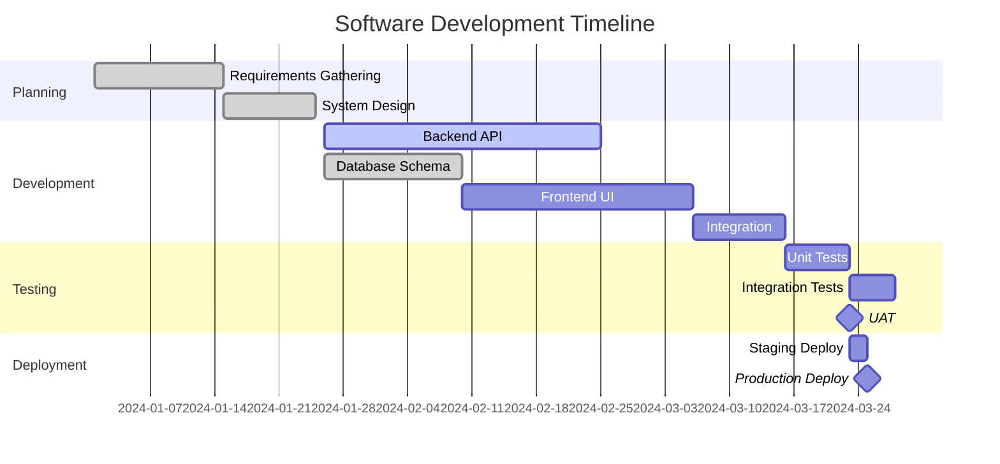
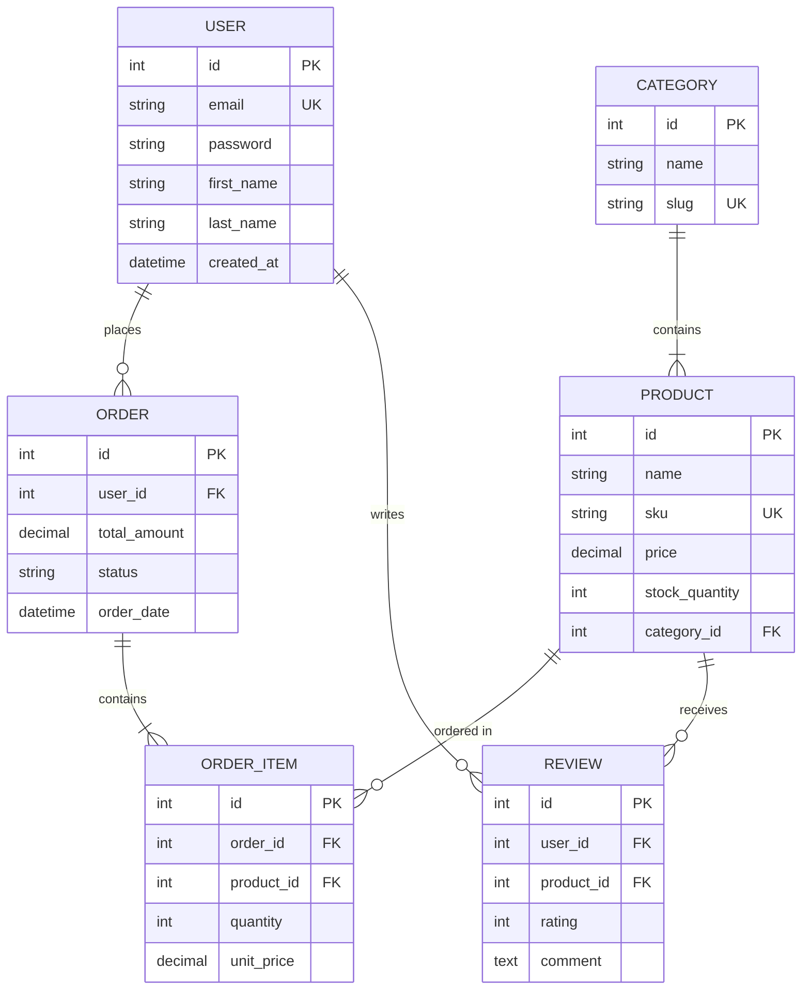
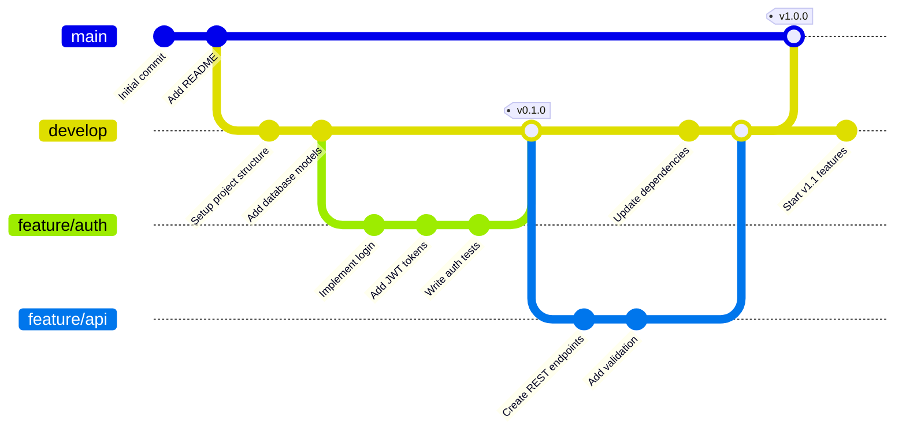
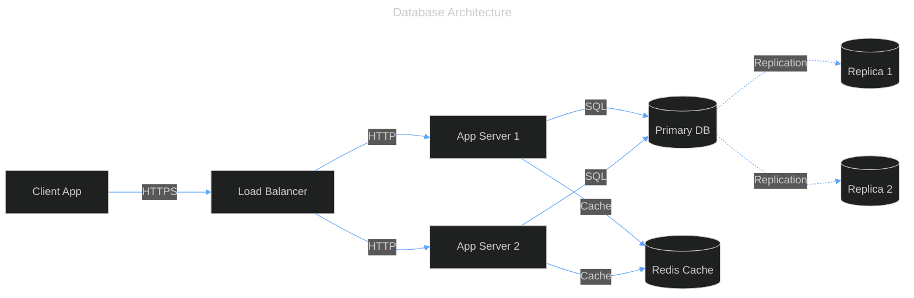
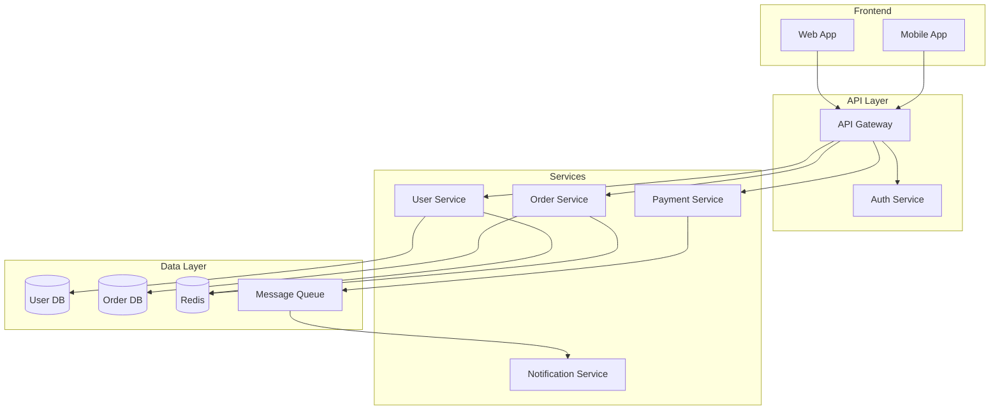
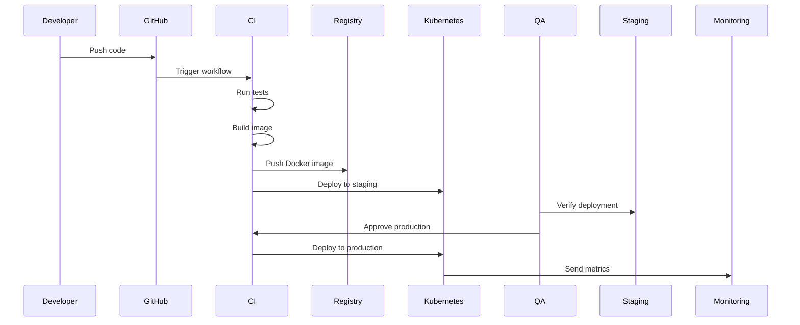

# Mermaid.js

Mermaid is a JavaScript-based diagramming and charting tool that renders Markdown-inspired text definitions to create and modify diagrams dynamically. It enables developers and non-programmers alike to create detailed visualizations using simple text syntax, solving the documentation problem where diagrams quickly become outdated. By allowing diagrams to be generated from code, Mermaid makes documentation maintainable and can be integrated directly into production workflows.

The library supports multiple diagram types including flowcharts, sequence diagrams, Gantt charts, class diagrams, git graphs, entity relationship diagrams, user journey maps, quadrant charts, and XY charts. Mermaid can be deployed via CDN, installed as an npm package, or integrated through numerous plugins across popular platforms. It provides both a Live Editor for quick prototyping and a comprehensive JavaScript API for programmatic diagram generation.

## APIs and Key Functions

### CDN Integration

Load Mermaid directly from a CDN without any build process or package installation.

```html
<!DOCTYPE html>
<html>
<head>
  <meta charset="utf-8">
  <title>Mermaid CDN Example</title>
</head>
<body>
  <h1>Network Architecture</h1>
  <pre class="mermaid">
    graph TD
      A[Client] --> B[Load Balancer]
      B --> C[Server01]
      B --> D[Server02]
      C --> E[(Database)]
      D --> E
  </pre>

  <h2>User Authentication Flow</h2>
  <pre class="mermaid">
    sequenceDiagram
      participant User
      participant App
      participant Auth
      participant DB

      User->>App: Login Request
      App->>Auth: Validate Credentials
      Auth->>DB: Query User
      DB-->>Auth: User Data
      Auth-->>App: JWT Token
      App-->>User: Login Success
  </pre>

  <script type="module">
    import mermaid from 'https://cdn.jsdelivr.net/npm/mermaid@11/dist/mermaid.esm.min.mjs';
    mermaid.initialize({ startOnLoad: true });
  </script>
</body>
</html>
```

### NPM Package Installation

Install Mermaid as a dependency for bundled applications with full configuration control.

```bash
# Install via npm
npm install mermaid

# Or via yarn
yarn add mermaid

# Or via pnpm
pnpm add mermaid
```

```javascript
// app.js - Using Mermaid in a Node.js/bundled application
import mermaid from 'mermaid';

// Initialize with custom configuration
mermaid.initialize({
  startOnLoad: true,
  theme: 'forest',
  securityLevel: 'loose',
  themeVariables: {
    primaryColor: '#4a90e2',
    primaryTextColor: '#fff',
    primaryBorderColor: '#2e5c8a',
    lineColor: '#F8B229',
    secondaryColor: '#006100',
    tertiaryColor: '#fff'
  },
  flowchart: {
    useMaxWidth: true,
    htmlLabels: true,
    curve: 'basis'
  }
});

// Dynamically render a diagram
const diagramDefinition = `
  graph LR
    A[Square Rect] --> B((Circle))
    A --> C(Rounded Rect)
    B --> D{Decision}
    C --> D
`;

const container = document.getElementById('diagram-container');
const { svg } = await mermaid.render('diagram-id', diagramDefinition);
container.innerHTML = svg;
```

### Programmatic Rendering with mermaid.render()

Generate SVG diagrams programmatically for dynamic content or server-side rendering.

```javascript
import mermaid from 'mermaid';

async function generateDiagram(definition, elementId) {
  try {
    // Configure before rendering
    mermaid.initialize({
      startOnLoad: false,
      theme: 'dark',
      logLevel: 'error'
    });

    // Render the diagram
    const { svg, bindFunctions } = await mermaid.render(elementId, definition);

    // Insert into DOM
    const element = document.getElementById('output');
    element.innerHTML = svg;

    // Bind interactive functions if needed
    if (bindFunctions) {
      bindFunctions(element);
    }

    return svg;
  } catch (error) {
    console.error('Diagram rendering failed:', error);
    throw error;
  }
}

// Example: Generate a class diagram
const classDiagram = `
  classDiagram
    class Animal {
      +String name
      +int age
      +makeSound() void
    }
    class Dog {
      +String breed
      +bark() void
    }
    class Cat {
      +String color
      +meow() void
    }
    Animal <|-- Dog
    Animal <|-- Cat
`;

generateDiagram(classDiagram, 'class-diagram-1')
  .then(svg => console.log('Diagram generated successfully'))
  .catch(err => console.error('Failed to generate:', err));
```

### Flowchart Syntax

Create flowcharts to visualize processes, workflows, and system architectures.

```markdown

```

### Sequence Diagram Syntax

Document interactions between components, API calls, and message flows.

```markdown

```

### Gantt Chart Syntax

Plan and visualize project timelines, milestones, and task dependencies.

```markdown

```

### Entity Relationship Diagram Syntax

Model database schemas and relationships between entities.

```markdown

```

### Git Graph Syntax

Visualize git branching strategies and commit workflows.

```markdown

```

### Frontmatter Configuration

Override default settings per-diagram using YAML frontmatter syntax.

```markdown

```

### Theme and Look Customization

Apply visual styles including hand-drawn and classic looks with different layout algorithms.

```html
<!DOCTYPE html>
<html>
<body>
  <!-- Hand-drawn style with ELK layout -->
  <pre class="mermaid">
---
config:
  look: handDrawn
  theme: neutral
  layout: elk
  elk:
    mergeEdges: true
    nodePlacementStrategy: BRANDES_KOEPF
---
flowchart TB
    Start[Start Process] --> Decision{Check Status}
    Decision -->|Active| ProcessA[Process Type A]
    Decision -->|Inactive| ProcessB[Process Type B]
    ProcessA --> Merge[Merge Results]
    ProcessB --> Merge
    Merge --> End[Complete]
  </pre>

  <!-- Classic style with Dagre layout -->
  <pre class="mermaid">
---
config:
  look: classic
  theme: forest
  layout: dagre
---
stateDiagram-v2
    [*] --> Idle
    Idle --> Processing: start()
    Processing --> Success: complete()
    Processing --> Error: fail()
    Success --> [*]
    Error --> Retry: retry()
    Retry --> Processing
    Error --> [*]: abort()
  </pre>

  <script type="module">
    import mermaid from 'https://cdn.jsdelivr.net/npm/mermaid@11/dist/mermaid.esm.min.mjs';
    mermaid.initialize({
      startOnLoad: true,
      logLevel: 'info'
    });
  </script>
</body>
</html>
```

### Security Configuration

Control security levels to prevent XSS attacks while maintaining diagram functionality.

```javascript
import mermaid from 'mermaid';

// Strict security for user-generated content
mermaid.initialize({
  startOnLoad: true,
  securityLevel: 'strict', // Prevents JavaScript execution
  theme: 'default'
});

// For trusted content with interactive features
mermaid.initialize({
  startOnLoad: true,
  securityLevel: 'loose', // Allows click events and links
  flowchart: {
    htmlLabels: true
  }
});

// Sandbox mode - renders in isolated iframe
mermaid.initialize({
  startOnLoad: true,
  securityLevel: 'sandbox', // Maximum security
  theme: 'default'
});

// Example with clickable nodes (requires loose security)
const interactiveDiagram = `
  graph TD
    A[Home Page] --> B[Products]
    A --> C[About]
    B --> D[Product Details]

    click A "https://example.com" "Go to Home"
    click B "https://example.com/products" "View Products"
    click C "https://example.com/about" "About Us"
`;

document.getElementById('diagram').innerHTML =
  await mermaid.render('interactive', interactiveDiagram);
```

### Markdown Native Support

Integrate Mermaid diagrams directly in Markdown files on GitHub, GitLab, and other platforms.

```markdown
# Project Architecture

Our microservices architecture consists of the following components:



## Deployment Process


```

## Summary

Mermaid excels at creating maintainable documentation by allowing diagrams to be version-controlled alongside code. Common use cases include documenting API flows with sequence diagrams, visualizing database schemas with ER diagrams, planning sprints with Gantt charts, and explaining system architecture with flowcharts. The text-based syntax ensures diagrams can be reviewed in pull requests, updated programmatically, and kept in sync with code changes without requiring specialized diagram editing tools.

Integration patterns range from simple CDN-based deployments for static sites to sophisticated npm-based installations for React, Vue, and Angular applications. The library supports server-side rendering, dynamic diagram generation from database schemas, automated documentation pipelines, and embedding in content management systems. Security features like sandboxed rendering make it safe for user-generated content, while the extensive theming system allows matching diagrams to brand guidelines. With support across GitHub, GitLab, Notion, Confluence, and hundreds of other platforms, Mermaid has become the de facto standard for diagrams-as-code.
