# Technical Architecture: Onchain Catalogue System

```mermaid
flowchart TD
    subgraph web["Web Interface"]
        A["palaupalau.eth"]
        B["Metadata Form"]
        B1["Schema:<br/>title, description<br/>media ipfs://CID<br/>createdBy address<br/>zoraNFT base:0x.../ID"]
    end
    
    subgraph access["Access Control"]
        C["Wallet Connect"]
        D["Curator Board Approval"]
        D1["Update Allowlist<br/>mapping address => bool<br/>isContributor"]
    end
    
    subgraph storage["Content Storage"]
        E["IPFS/Storacha"]
        E1["Upload metadata<br/>with CID returned<br/>Include Zora NFT ref"]
    end
    
    subgraph l2["Base L2"]
        H["Zora Creator NFT"]
        H1["Wait for event:<br/>ZoraMinted<br/>address, uint256 tokenId"]
        I["Capture Token ID"]
    end
    
    subgraph l1["Ethereum L1"]
        F["Factory Contract<br/>(Main Orchestrator)"]
        F0["Register Release<br/>with metadata & tokenId"]
        F1["Mint ENS Subname<br/>pda-XXX.palaupalau.eth"]
        F2["Set ENS Text Record<br/>ensResolver.setText<br/>zoraNFT reference"]
        F3["Manage Allowlist<br/>mapping address => bool"]
        G["Emit ReleaseAdded<br/>subname, contributor<br/>metadataURI, tokenId"]
    end
    
    subgraph indexing["Event Indexing"]
        J["Event Listener<br/>ReleaseAdded"]
        K["The Graph Subgraph<br/>Query: subname, address<br/>tokenId, metadataURI"]
    end
    
    subgraph display["API & Display"]
        L["GraphQL API"]
        L1["Fallback Logic:<br/>If Graph fails use<br/>ensResolver.getText<br/>to retrieve zoraNFT"]
        M["Catalog Frontend<br/>ENS → Zora → IPFS<br/>fallback chain"]
    end
    
    A --> B
    B --> B1
    B1 --> C
    C --> D
    D --> D1
    
    D1 -->|Approved| E
    E --> E1
    E1 -->|metadata CID| H
    
    H --> H1
    H1 --> I
    I -->|tokenId| F
    
    F --> F0
    F0 --> F1
    F1 --> F2
    F2 --> F3
    F3 --> G
    
    G -->|Emit| J
    J --> K
    K -->|Index| L
    
    L --> L1
    L1 --> M
    
    style web fill:#1e3a8a,stroke:#3b82f6,color:#fff
    style access fill:#1e3a8a,stroke:#3b82f6,color:#fff
    style storage fill:#0ea5e9,stroke:#06b6d4,color:#fff
    style l1 fill:#7c3aed,stroke:#a855f7,color:#fff
    style l2 fill:#7c3aed,stroke:#a855f7,color:#fff
    style indexing fill:#059669,stroke:#10b981,color:#fff
    style display fill:#d97706,stroke:#f59e0b,color:#fff
```



## MVP Definition

> Contributors submit metadata → receive catalog ID (PDA-XXX) → mint NFT on Base → link to ENS subname on L1 → index via events → display on web. Single factory contract, IPFS storage, curator approval gate. Immutable releases, discoverable catalog, minimal complexity. Onchain catalogue system.

---

## Architecture Overview

The technical architecture consists of **7 integrated layers** with code-level implementation details:

### 🎨 Web Interface Layer
- **palaupalau.eth**: Entry point for the catalogue ecosystem
- **Metadata Form**: User interface for contributors to submit release information

**Metadata Schema:**
```json
{
  "title": "Release Title",
  "description": "Short description",
  "media": "ipfs://<CID>",
  "createdBy": "0xContributorAddress",
  "zoraNFT": "base:0xNFTContract/TokenID"
}
```

**Purpose:** User-facing entry point with standardized metadata structure.

### 🔐 Access Control Layer
- **Wallet Connect**: EVM wallet authentication
- **Curator Board Approval**: Quality gate for contributor submissions
- **Update Allowlist**: Maintains list of approved contributors

**Smart Contract Code:**
```solidity
mapping(address => bool) public isContributor;

function approveContributor(address contributor) public onlyBoard {
    isContributor[contributor] = true;
}
```

**Purpose:** Prevents spam, ensures quality releases while maintaining minimal overhead (no full DAO).

### 🗄️ Content Storage Layer
- **IPFS/Storacha**: Decentralized, content-addressed storage for all release data
- **Upload Process**: Metadata uploaded with CID returned, includes Zora NFT reference

**Storage Details:**
- Metadata must match the schema above
- Includes reference to Zora NFT address and token ID
- Content-addressed via IPFS CID (immutable)
- Pinned via Storacha for persistence

**Purpose:** Persistent, immutable content storage. Cost-optimized via Storacha or Autark CLI.

### ⛓️ Base L2 Layer
- **Zora Creator NFT**: Mints the release as an NFT (cost-optimized)
- **Event Emission**: Waits for `ZoraMinted` event confirmation
- **Capture Token ID**: Extracts token ID for factory contract coordination

**Smart Contract Event:**
```solidity
event ZoraMinted(address indexed contractAddr, uint256 indexed tokenId);
```

**Purpose:** L2 reduces gas costs by ~90% vs. L1. Zora provides battle-tested NFT infrastructure. Event-driven ensures atomicity.

### ⛓️ Ethereum L1 Layer
- **Factory Contract**: Orchestrates the entire release flow
  - Mints ENS subname (e.g., `pda-XXX.palaupalau.eth`)
  - Sets ENS resolver with Zora NFT reference
  - Emits `ReleaseAdded` event for indexing
  
- **ENS Resolver Integration**: Links Base NFT to L1 ENS subname

**Factory Contract Code:**
```solidity
event ReleaseAdded(
    string indexed subname,
    address indexed contributor,
    string metadataURI,
    uint256 tokenId
);

function registerRelease(
    string memory subname,
    address contributor,
    string memory metadataURI,
    uint256 tokenId
) public onlyFactory {
    // Mint ENS subname
    ens.setSubnodeOwner(namehash("palaupalau.eth"), keccak256(subname), address(this));
    
    // Set text record linking to Zora NFT
    ensResolver.setText(
        namehash(string.concat(subname, ".palaupalau.eth")),
        "zoraNFT",
        string.concat("base:0x", toHexString(nftContract), "/", toString(tokenId))
    );
    
    emit ReleaseAdded(subname, contributor, metadataURI, tokenId);
}
```

**Purpose:** L1 provides immutability and finality. Factory coordinates all processes. ENS provides human-readable identifiers linked to Base NFTs.

### 🔍 Event Indexing Layer
- **Event Listener**: Subscribes to `ReleaseAdded` events from Factory Contract
- **The Graph Subgraph**: Indexes events and maintains queryable catalogue state

**Subgraph Schema:**
```graphql
type Release @entity {
  id: ID!
  subname: String!
  contributor: Bytes!
  metadataURI: String!
  tokenId: BigInt!
  createdAt: BigInt!
  contractAddress: Bytes!
}

type ReleaseAdded @event {
  subname: String!
  contributor: Bytes!
  metadataURI: String!
  tokenId: BigInt!
}
```

**Purpose:** Enables fast, queryable access to catalogue data without centralized database. Decentralized indexing via The Graph.

### 🌐 API & Display Layer
- **GraphQL API**: Exposes indexed catalogue data for queries
- **Fallback Logic**: If The Graph is unavailable, queries ENS resolver directly
- **Catalog Frontend**: Next.js application with multi-source data chain

**Frontend Fallback Implementation:**
```typescript
async function getRelease(subname: string) {
  try {
    // Primary: Query The Graph
    const release = await graphqlClient.query({
      query: GET_RELEASE,
      variables: { subname }
    });
    return release;
  } catch (error) {
    // Fallback: Query ENS resolver
    const nftRef = await ensResolver.getText(
      namehash(`${subname}.palaupalau.eth`),
      "zoraNFT"
    );
    
    // Parse nftRef: "base:0xContractAddress/TokenID"
    const [chain, contractAndToken] = nftRef.split(":");
    const [contract, tokenId] = contractAndToken.split("/");
    
    // Fetch metadata from Zora
    const metadata = await zoraAPI.getNFT(contract, tokenId);
    return metadata;
  }
}
```

**Data Resolution Chain:** ENS Subname → Zora NFT Contract/ID → IPFS Metadata

**Purpose:** Resilient data retrieval with multi-layer fallback. Ensures catalogue remains accessible even if indexer goes down.

---

## Data Flow (MVP Path)

1. Contributor visits **palaupalau.eth**
2. Submits metadata via **Metadata Form** (matching schema)
3. Connects wallet via **Wallet Connect**
4. **Curator Board** reviews and approves request
5. Contributor added to **isContributor** allowlist
6. Metadata uploaded to **IPFS** → returns content hash (CID)
7. **Zora Creator** mints NFT on **Base L2** with metadata URI
8. **ZoraMinted** event emitted with contract address and token ID
9. **Factory Contract** receives token ID
10. **Factory** mints ENS subname `pda-XXX.palaupalau.eth` on **L1**
11. **Factory** calls ENS resolver to set `zoraNFT` text record
12. **Factory** emits `ReleaseAdded` event with subname, contributor, metadataURI, tokenId
13. **Event Listener** captures `ReleaseAdded` event
14. **The Graph** indexes release into subgraph
15. **GraphQL API** exposes queryable catalogue data
16. **Catalog Frontend** queries API (with fallback to ENS resolver)
17. Release appears live on catalogue website

---

## Technology Stack Rationale

| Component | Choice | Why |
|-----------|--------|-----|
| **Frontend** | Next.js | SSR for SEO, static export for performance |
| **L1 Blockchain** | Ethereum | Canonical ENS registry, immutable finality |
| **L2 Blockchain** | Base | 90%+ cheaper gas than L1 for NFT minting |
| **NFT Standard** | Zora Creator | Pre-built minting, royalty support, ecosystem |
| **Release ID** | ENS Subnames | Human-readable, decentralized, linked to parent |
| **Content Storage** | IPFS/Storacha | Decentralized, content-addressed, persistent |
| **Indexing** | The Graph | Decentralized, queryable, event-driven |
| **ENS Linking** | Text Records | Flexible, upgradeable, supports arbitrary metadata |
| **Approval Gate** | Curator Board | Quality control without full DAO complexity |

---

## Key Minimalist Decisions

✅ **Single Factory Contract** - Reduces complexity, single point of coordination  
✅ **Curator Approval Gate** - Prevents spam, ensures quality without full DAO overhead  
✅ **Event-Driven Indexing** - No centralized database, fully immutable record  
✅ **IPFS for Content** - Decentralized, cost-optimized with Storacha  
✅ **Base L2 for NFTs** - 90%+ cheaper than Ethereum L1 for minting  
✅ **ENS Subnames** - Human-readable catalogue IDs with L1 finality  
✅ **ENS Text Records** - Links Base NFTs to L1 registry without custom resolver contracts  
✅ **Fallback Logic** - Frontend resilience if Graph indexer fails  
✅ **No Soulbound NFT in MVP** - Simplified contributor permissioning (approval gate sufficient)  

---

## Next Steps (Research & Development)

- [ ] Define Factory Contract interface (methods, events, access control)
- [ ] Implement ENS text record storage for zoraNFT references
- [ ] Spec The Graph subgraph schema and mappings
- [ ] Estimate gas costs (L1 subname minting + Base NFT minting)
- [ ] Prototype contributor UX flow with form validation
- [ ] Define curator board structure and approval workflow
- [ ] Build frontend fallback logic for Graph outages
- [ ] Test cross-chain coordination (Base → L1)
- [ ] Design release numbering logic (PDA-XXX sequence)
