# Types.ts Execution Flow Diagram

## **The Complete Picture: From User to Blockchain**

```mermaid
---
config:
  theme: default
  themeVariables:
    primaryColor: "#4a90e2"
    primaryTextColor: "#fff"
    primaryBorderColor: "#2e5c8a"
    lineColor: "#F8B229"
    secondaryColor: "#006100"
    tertiaryColor: "#fff"
  flowchart:
    useMaxWidth: true
    htmlLabels: true
    curve: basis
---
flowchart TD
    Start([User Submits Release])
    
    Start --> MetadataForm["<b>components/MetadataForm.tsx</b><br/>Renders form"]
    
    MetadataForm --> Validate["<b>Form Validation</b><br/>lib/validation.ts::ReleaseSubmissionSchema<br/>Type: ReleaseSubmissionInput<br/>{title, description, media, artists?, duration?}"]
    
    Validate --> ValidatePass{Valid Input?}
    ValidatePass -->|No| ValidateFail["Show validation errors"]
    ValidateFail --> MetadataForm
    
    ValidatePass -->|Yes| SubmitStore["<b>onSubmit:</b><br/>useCatalogueStore.submitRelease<br/>Input: ReleaseSubmissionInput"]
    
    SubmitStore --> FetchAPI["<b>lib/store.ts::submitRelease()</b><br/>Creates Release with id, status='pending'<br/>Calls: fetch('/api/submit', POST, input)<br/>Returns: Promise&lt;Release&gt;"]
    
    FetchAPI --> MSWIntercept["<b>lib/mocks/handlers.ts (MSW)</b><br/>Input: ReleaseSubmissionInput<br/>Creates Release {<br/>  id: 'PDA-001',<br/>  ...input,<br/>  createdBy: wallet,<br/>  status: 'pending',<br/>  createdAt: now()<br/>}<br/>Stores in: pending: Release[]<br/>Returns: Response.json(release)"]
    
    MSWIntercept --> UpdateState["<b>Store updates state</b><br/>pendingRequests: Release[]<br/>Triggers component re-render<br/>Show: 'Awaiting curator approval'"]
    
    UpdateState --> Pending["⏳ PENDING STATUS"]
    
    Pending --> TimePass["<b>[TIME PASSES - CURATOR REVIEWS]</b>"]
    
    TimePass --> CuratorDash["<b>components/CuratorDashboard.tsx</b><br/>Fetches: pendingRequests<br/>Receives: Release[] with status='pending'<br/>Displays: ApprovalCard for each Release"]
    
    CuratorDash --> CuratorApprove["<b>Curator clicks 'Approve'</b><br/>Calls: store.approveRelease(releaseId)<br/>Signature: approveRelease(id: string)<br/>→ Promise&lt;PublishedRelease&gt;"]
    
    CuratorApprove --> ApproveAPI["<b>lib/store.ts::approveRelease()</b><br/>Calls: fetch('/api/approve/:id', POST)<br/>Returns: Promise&lt;PublishedRelease&gt;"]
    
    ApproveAPI --> MSWApprove["<b>lib/mocks/handlers.ts</b><br/>Finds: release by id in pending[]<br/>Updates:<br/>  release.status = 'approved'<br/>  release.approvedBy = curatorWallet<br/>  release.approvedAt = now()<br/>Returns: updated Release<br/>Triggers: IPFS metadata creation"]
    
    MSWApprove --> IPFSMeta["<b>lib/utils/ipfs.ts</b><br/>releaseToIPFSMetadata(Release)<br/>Creates IPFSMetadata {<br/>  name: release.title,<br/>  description: release.description,<br/>  image: release.media,<br/>  animation_url: release.media,<br/>  content: {mime, uri},<br/>  properties: {<br/>    catalogueId: release.id,<br/>    approvedBy: release.approvedBy,<br/>    approvedAt: release.approvedAt,<br/>    ... all catalogue metadata<br/>  }<br/>}<br/>Validates: IPFSMetadataSchema.parse(result)"]
    
    IPFSMeta --> IPFSUpload["<b>Upload to IPFS</b><br/>Serialize IPFSMetadata to JSON<br/>POST to pinata/nft.storage/gateway<br/>Returns: CID = 'QmXXXXXX...'<br/>metadataURI = 'ipfs://QmXXXXXX...'<br/>Store in: release.metadataURI"]
    
    IPFSUpload --> ZoraMint["<b>Mint NFT on Zora (Base L2)</b><br/>Contract: Zora Creator<br/>tokenURI: metadataURI (ipfs://...)<br/>Mint: await zora.mint({<br/>  to: createdBy,<br/>  tokenURI: metadataURI<br/>})<br/>Returns: txHash, tokenId<br/>Store in:<br/>  release.tokenId = tokenId<br/>  release.zoraNFT = 'base:0xZora/tokenId'<br/>  release.status = 'published'"]
    
    ZoraMint --> ENSReg["<b>Register ENS Subname (L1)</b><br/>Subname: 'first-release.palaupalau.eth'<br/>Set text records:<br/>  'catalogue-id' → 'PDA-001'<br/>  'metadata' → metadataURI<br/>  'nft' → release.zoraNFT<br/>Store: release.ensSubname"]
    
    ENSReg --> Published["✅ RELEASE PUBLISHED<br/>Type: PublishedRelease (all fields required)<br/>Accessible via:<br/>1. Catalogue direct lookup (fastest)<br/>2. ENS resolution (canonical)<br/>3. IPFS fetch (content-addressed)<br/>4. Zora blockexplorer (blockchain truth)"]
    
    Published --> DiscoverStart["<b>[USER DISCOVERS RELEASE]</b>"]
    
    DiscoverStart --> Homepage["<b>User visits homepage</b><br/>Component: ReleaseCatalog.tsx<br/>Calls: useCatalogueStore.allReleases<br/>Type: PublishedRelease[]<br/>Maps: Release[] → &lt;ReleaseCard&gt; components"]
    
    Homepage --> ReleaseCard["<b>Each ReleaseCard displays</b><br/>function ReleaseCard({<br/>  release<br/>}: {<br/>  release: PublishedRelease<br/>})<br/>return (<br/>  &lt;Link href={`/release/${release.id}`}&gt;<br/>    &lt;h3&gt;{release.title}&lt;/h3&gt;<br/>    &lt;p&gt;{release.description}&lt;/p&gt;<br/>    &lt;p&gt;NFT: {release.zoraNFT}&lt;/p&gt;<br/>  &lt;/Link&gt;<br/>)<br/>All fields guaranteed to exist (type-safe)"]
    
    ReleaseCard --> UserClick["<b>User clicks → /release/PDA-001</b><br/>Component: ReleaseDetailPage.tsx<br/>Queries: store.getReleaseBySubname('PDA-001')<br/>Returns: Release | null<br/>If found: display full metadata<br/>If not found: trigger fallback"]
    
    UserClick --> Fallback["<b>Fallback resolution chain</b>"]
    
    Fallback --> FB1["1️⃣ getReleaseBySubname('PDA-001')<br/>Direct catalogue lookup<br/>Type: Release | null ✅"]
    
    FB1 --> FB1Check{Found?}
    FB1Check -->|Yes| DisplayDetail
    FB1Check -->|No| FB2
    
    FB2["2️⃣ Try ENS<br/>Resolve 'first-release.palaupalau.eth'<br/>Read text record 'catalogue-id'<br/>Query catalogue<br/>Type: Release | null ✅"]
    
    FB2 --> FB2Check{Found?}
    FB2Check -->|Yes| DisplayDetail
    FB2Check -->|No| FB3
    
    FB3["3️⃣ Try IPFS direct<br/>Fetch ipfs://QmXXX<br/>Parse: IPFSMetadata<br/>Convert to: Release ✅"]
    
    FB3 --> FB3Check{Found?}
    FB3Check -->|Yes| DisplayDetail
    FB3Check -->|No| FB4
    
    FB4["4️⃣ Try Zora<br/>Query Base L2<br/>Get tokenURI<br/>Fetch IPFS<br/>Type: Release ✅"]
    
    FB4 --> ResolutionResult["<b>Result: ResolutionResult</b><br/>{<br/>  source: 'catalogue'|'ens'|'ipfs'|'zora',<br/>  release: Release,<br/>  fallbackUsed: boolean<br/>}"]
    
    ResolutionResult --> DisplayDetail["<b>Display Release Detail</b><br/>Show: title, description, media<br/>Show: 'Curator: 0x...'<br/>Show: 'NFT: base:0xZora/123'<br/>Show: 'IPFS: ipfs://QmXXX'<br/>Show: 'ENS: first-release.palaupalau.eth'<br/>Show fallback badge if used<br/>All from single Release object"]
    
    DisplayDetail --> End([Complete])
    
    style Start fill:#90EE90
    style End fill:#FFB6C1
    style Published fill:#4ECDC4
    style Pending fill:#FFD700
    style DiscoverStart fill:#87CEEB
    style DisplayDetail fill:#DDA0DD
```



---

## **Data Shape Consistency Across All Points**

```
┌──────────────────┐
│  types.ts        │
│  ┌────────────┐  │
│  │ Release    │  │◄─── SINGLE SOURCE OF TRUTH
│  │ IPFSMetadata
│  │ ReleaseInput
│  └────────────┘  │
└──────────────────┘
        ▲
        │
    ┌───┴───┐
    │       │
┌───┴──┐  ┌─┴────┐
│ Store│  │ Utils│
└───┬──┘  └──┬───┘
    │        │
┌───┴─┬──┐   │
│     │  │   │
UI   API Mocks─ All reference same types
```

Every file that touches Release data imports it from types.ts. This ensures:
- ✅ No drift between what store returns and what components expect
- ✅ Mocks have same shape as real API responses
- ✅ Validation matches data types
- ✅ IPFS metadata conversion is type-safe

---

## **Key Type Transitions Through Lifecycle**

```
ReleaseSubmissionInput (what user provides)
        ↓ (validated by ReleaseSubmissionSchema)
        ↓
PendingRelease (status='pending')
        ↓ (curator approves)
        ↓
ApprovedRelease (status='approved', with approvedBy/approvedAt)
        ↓ (upload to IPFS + mint NFT)
        ↓
PublishedRelease (status='published', with zoraNFT, metadataURI)
        ↓ (register ENS)
        ↓
Release (fully resolved, all optional fields populated)
```

Each transition is type-safe:
- TypeScript prevents transitioning from pending to published without approval
- Function signatures enforce correct state: `approveRelease(id) → PublishedRelease`
- Components can be type-guarded: only show NFT details on PublishedRelease

---

## **No Runtime Surprises**

Example of how types prevent common bugs:

```typescript
// ❌ WITHOUT TYPES: Runtime error
function displayNFT(release) {
  return <div>{release.zoraNFT}</div>;  // What if it's undefined?
}

// ✅ WITH TYPES: Compile-time error
function displayNFT(release: Release) {
  return <div>{release.zoraNFT}</div>;  // zoraNFT is optional ✅
  // TypeScript: "Property 'zoraNFT' does not exist on type 'Release'"
}

// ✅ WITH STATE TYPES: Type-safe
function displayNFT(release: PublishedRelease) {
  return <div>{release.zoraNFT}</div>;  // guaranteed to exist ✅
}
```

This catches errors **before** you run the code.

---

## **Summary**

Every layer of your application flows from types.ts:

1. **User submits form** → validated against ReleaseSubmissionInput
2. **Store receives input** → creates Release with status='pending'
3. **Curator approves** → Release transitions to status='approved'
4. **IPFS metadata created** → uses Release to build IPFSMetadata (type-safe mapping)
5. **NFT minted** → Release now status='published'
6. **ENS registered** → Release accessible via multiple paths
7. **User discovers** → any resolution path returns same Release type

All type-safe, all consistent, all documented.

